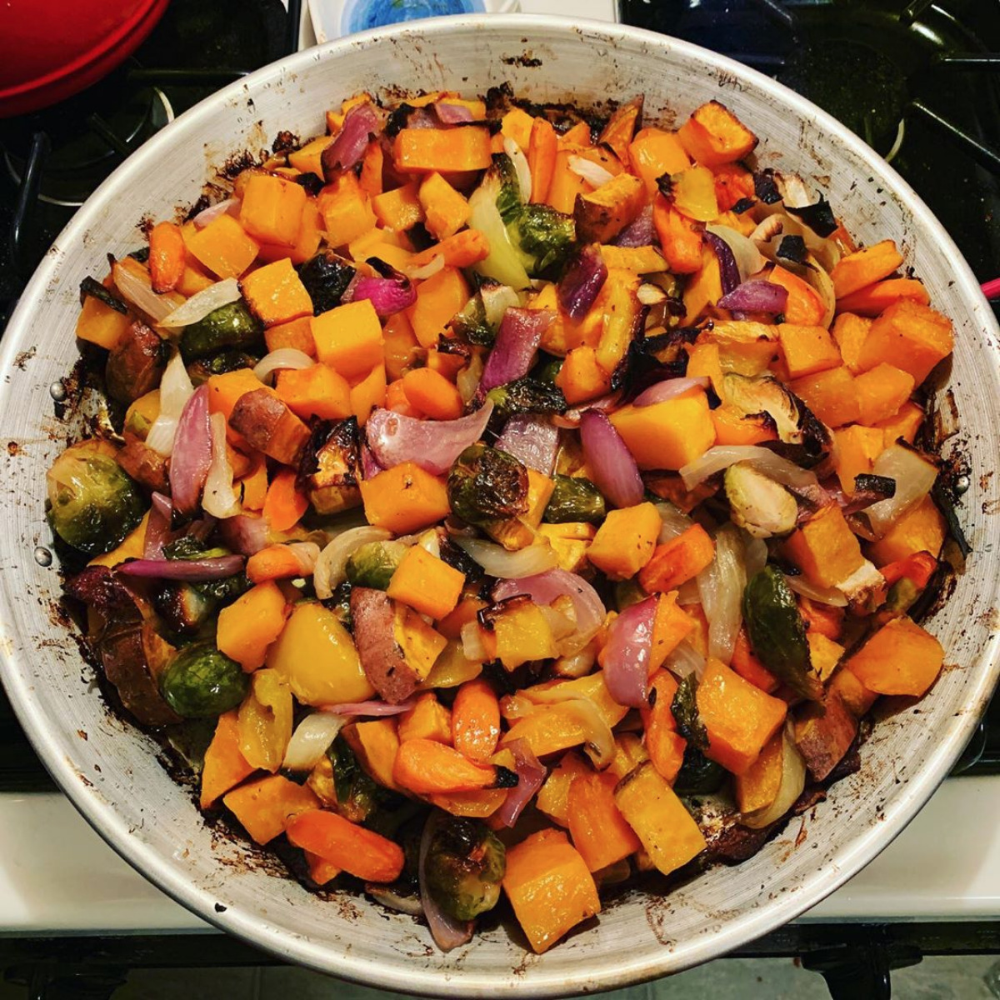
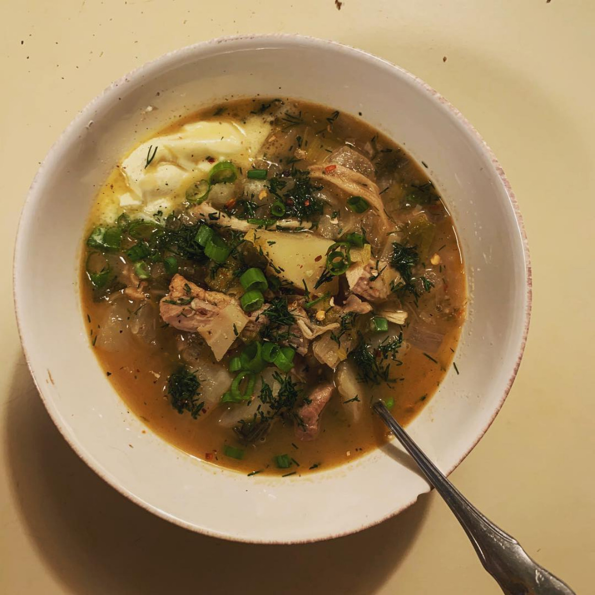

If we were hanging out for just a short period of time, you would see pretty quickly that I love to eat meat. Whether it be a succulent dry aged beef rib eye, Thanksgiving dinners with 32 lbs birds,  or the "Fat Tony"; a burger topped with all the fixin's of a Ruben during a 3 hour layover in Washington DC, I will always be searching out the best eats.

With all that being said I just roasted a fat pan of beautiful vegetables the other night. It all started with a base of squash and sweet potatoes. Then came a beautiful layer of bell peppers and onions both red and sweet. At this point I should probably mention I just got a new chef knife so chopping through a large bowl full of fresh veggies was a pleasure. The mess was finished up with brussels sprouts, carrots, and some crushed garlic. Right about now is when I came to the realization; there was no shot all of this was fitting on these measly sheet pans I have meticulously wrapped in foil. Maybe half would max but this was a weekly meal prep so a half batch just wouldn't cut it. After thinking for a moment and rummaging around to the deepest corners of the kitchen I found a vessel worthy of the challenge of this veggie roast; the paella pan. I loaded everything snugly into the pan. Since I knew the final destination of these vegetables was salads of all sorts, I wanted a zesty flavor to compliment the hearty assortment. I grabbed Italian dressing and combined with garlic, shallot, olive oil, and about *40 million* cracks of black pepper. Additionally I added a good splash of balsamic vinegar for brightness. Salt and (more) pepper to taste then into the oven for about an hour mixing every 20 minutes or so.

Long story short, a sheet pan, or paella pan, of roasted vegetables is great. As long as you can chop things, it's incredibly easy to make. It is a fast way to clean out the fridge of any 'close 2 go' veggies. Shopping is whatever is available, delicious and in season. Most importantly, roasted vegetables are great as a side,  a main, on top of salads, or under meats. Anyway I can get em, Ill be looking to add some to my plate and if nothing else, I'm sure we can use some more vegetables in our diets. 

---

## Oven Roasted Vegetables

Use whatever is fresh and available to you. This is just a guide.

1 cup each:

- squash
- brussels sprouts
- sweet potatoes
- onions

carrots - half cup

### Dressing

- Italian dressing - 1/2 cup
- olive oil - 1/2 cup
- 1 - 2 shallot - diced
- garlic - 4 cloves

### Steps

1. Preheat oven to 400F.
2. Chop all vegetables you have into roughly 1/2 inch cubes.
3. Toss vegetables in the dressing.
4. Roast in oven until done, about 1 hour. Tossing every 20 minutes.
5. Season with salt and pepper, to taste.

Enjoy on a salad, as a side dish, or anyway you please.

---

*If you want to see more, [follow my Instagram](https://www.instagram.com/mixedbageats/)* 

